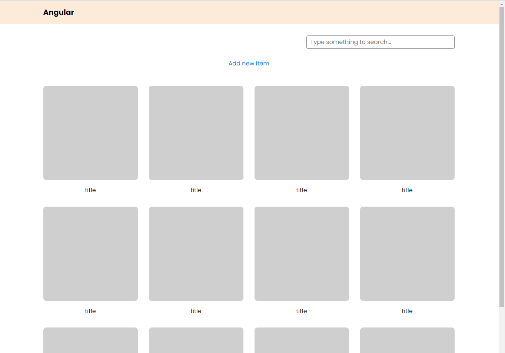
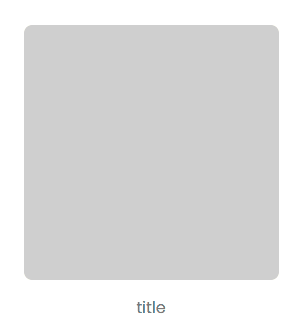
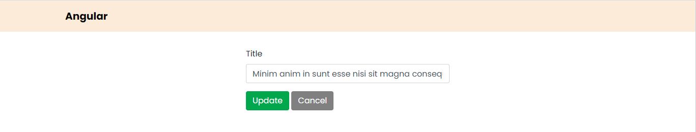
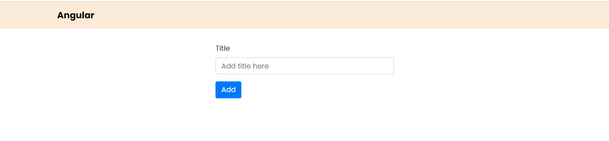

# angular-test

## Requirement

Create a SPA using Angular framework includes 3 pages bellow:

## Dashboard page

The url: /dashboard

<div align="center">
  
  <p>Dashboard page</p>
</div>

<div align="center">
  
  <p>Hover on a item</p>
</div>

- Click on [Add new item] button to redirect to create page
- Click on [Edit] button to redirect to Edit page
- Click on [Remove] button to remove item from list
- Type something to search box to search item with title

## Detail page

The url: /edit/item-id

<div align="center">
  
  <p>Edit page</p>
</div>

- Click on [Update] button to save and redirect to dashboard page
- Click on [Cancel] button to unsave and redirect to dashboard page

## Create page

The url: /create

<div align="center">
  
  <p>Create page</p>
</div>

- Click on [Add] button to add new item (not redirect)

## Note

item model

```ts
interface Item {
  id: number;       // id of item
  title: string;    // title of item
  img: string;      // image source (mock random in assets folder)
}
```
